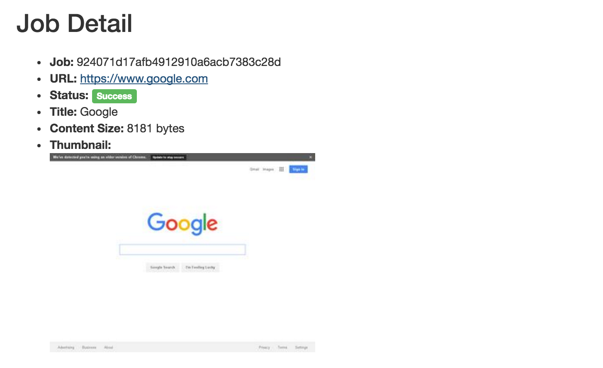

# Fetch Me If You Can!

Give this web app a URL and it will attempt to fetch the site contents for you asynchrously. Use the job ID to retrieve those contents at a later time.

  * `POST /api/job` - kick off a job to fetch web content

     ```bash
     $ curl -X POST "http://localhost:4000/api/job" \
         -H "Content-Type: application/json" \
         -d '{"url":"https://www.youtube.com/watch?v=dQw4w9WgXcQ"}'
     {
       "url": "https://www.youtube.com/watch?v=dQw4w9WgXcQ",
       "title": null,
       "status": "processing",
       "id": "2d80bd8dc50140089ae1ce6766f38c57",
       "content": null
     }
     ```
  * `GET /api/job` - return the status of a previously run job

    ```bash
    $ curl "http://localhost:4000/api/job/2d80bd8dc50140089ae1ce6766f38c57"
    {
      "url": "https://www.youtube.com/watch?v=dQw4w9WgXcQ",
      "title": "Rick Astley - Never Gonna Give You Up - YouTube",
      "status": "success",
      "id": "2d80bd8dc50140089ae1ce6766f38c57",
      "content": "<!DOCTYPE html><html..."
    }
    ```

Thanks to the magic of [Phoenix](http://www.phoenixframework.org), it also provides an admin view of the jobs that have been run.


A detailed display provides job status and a thumbnail:



## Installation

You'll need [elixir](http://elixir-lang.org/), along with:

  * [redis](http://redis.io/) - key-value store for the job queue
  * [postgres](https://www.postgresql.org/) - database for job status and website content

Once configured, update `config/dev.exs` with your database creds:

    config :fetch_me_if_you_can, FetchMeIfYouCan.Repo,
      adapter: Ecto.Adapters.Postgres,
      username: "postgres",
      password: "postgres",

Then:

  * Install mix dependencies with `mix deps.get`
  * Create and migrate your database with `mix ecto.create && mix ecto.migrate`
  * Start Phoenix endpoint with `mix phoenix.server`

Now you can visit [`localhost:4000`](http://localhost:4000) from your browser. To view the jobs admin, visit [`localhost:4000/jobs`](http://localhost:4000/jobs)

## Notes

1. Building this just involved connecting a few frameworks and libraries. The bulk of the development work was in:
    1. [the worker](lib/fetch_me_if_you_can/fetcher.ex)
    1. [the controller](web/controllers/api/job_controller.ex)
    1. and to a lesser extent, [the view](web/views/api/job_view.ex) and [the model](web/models/job.ex).
1. The service treats every request uniquely. Probably want some sort of cleanup service that prunes old data periodically. Better yet, why store the data in a database at all? Just store in redis with a reasonable TTL.
1. Testing and security were not considerations, so _don't use this in production_.
1. This was pretty fun to put together!
